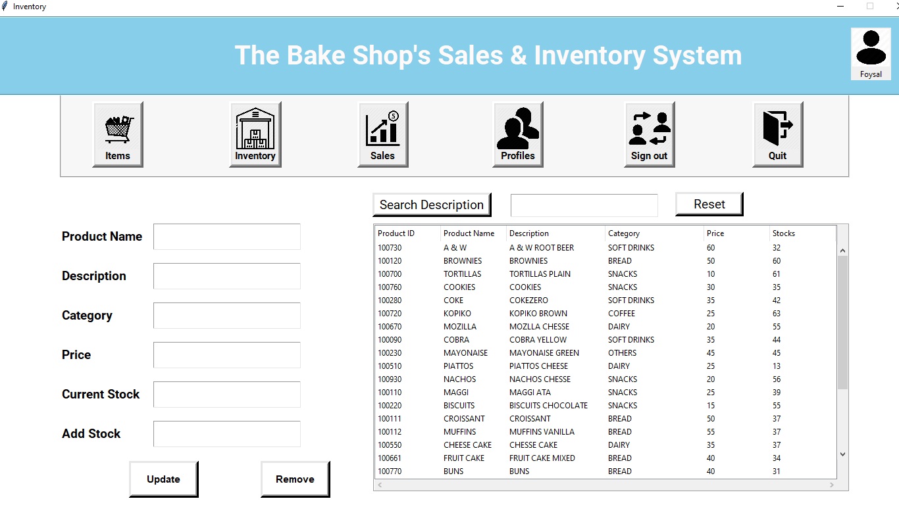
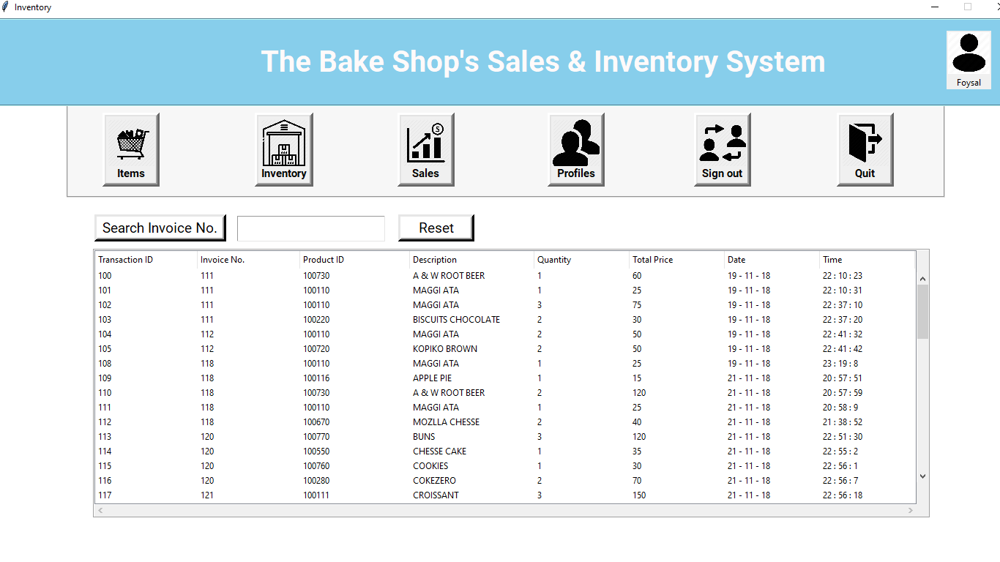
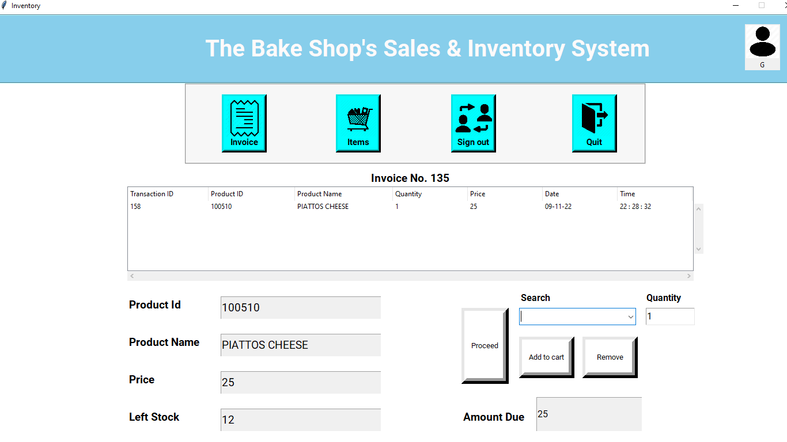

# Sales-and-Inventory-Management-System

#### Sales and Inventory Management System is a Tkinter (python module) based GUI application to generate sales invoices and maintence of inventory.

*	This application works on two levels of users, each category has different levels of rights to update the data & maintenance of masters like below.

##### For Admin (Owner)
*	Add/Remove/Edit Products
*	Track Inventory
*	Check and review Sales data
*	Add/Remove Transactional users (Staff) 

#### For Transactional Users
*	Make Invoice
*	Check Available Products

### Need More Info? 
[Documentation](https://github.com/)

# Requirements
```
Operating System -: Windows
python -v 3
```

# Setup 
```
pip install -r requirements.txt
```

# Execution
```
python main.py
```

# Features / Queries
Project features and queries are being tracked [here](https://github.com/).
# Sales-Management-System-Project-using-Python






